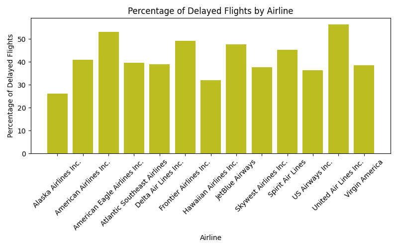
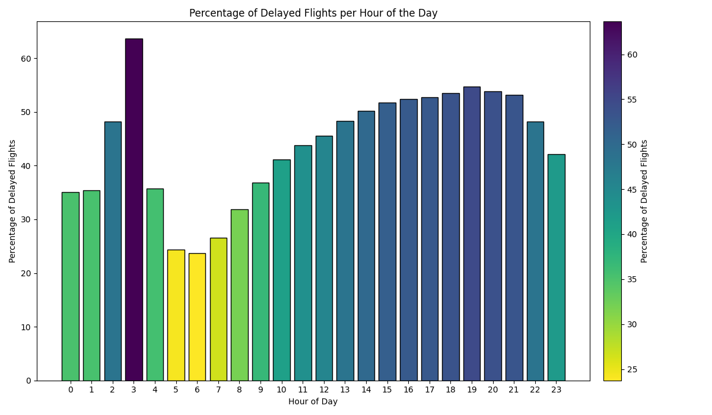
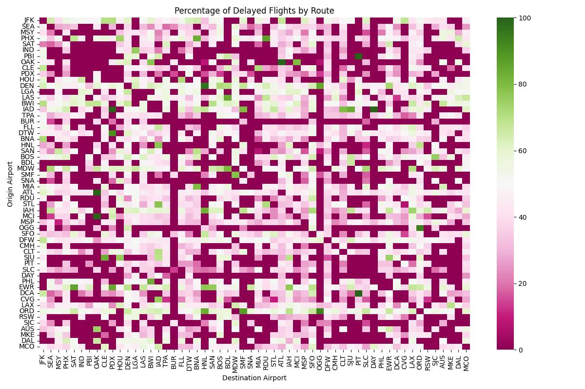
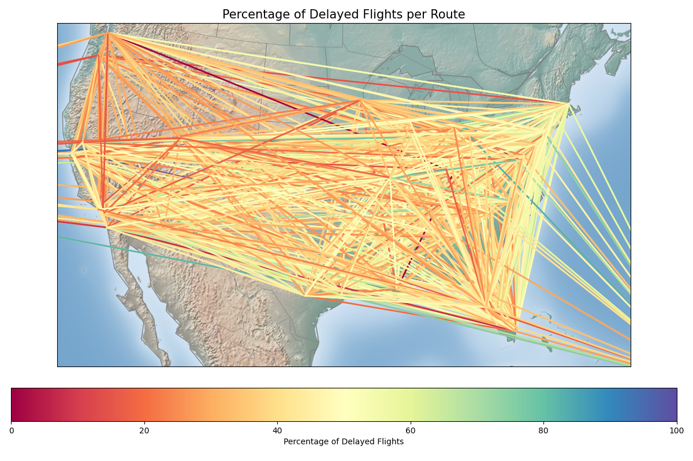

# SkySQL - Flight Data Analysis

This project provides various functionalities for analysing flight data, including displaying flights, displaying delays and visualising data on a map.
It also includes a web-based interface for visualising flight data and a Flask API for accessing detailed flight information. The web interface displays various analyses and visualisations, while the API provides endpoints for querying flight details based on various criteria.

## Features

The following functionalities are available in the program:

1. **Show flight by ID**
- Displays the details of a flight based on its ID.
2. **Show flights by date**
- Displays all flights scheduled on a given date. (Please select a date for 2015)
3. **Delayed flights by airline**
- Displays the number of delayed flights for each airline.
4. **Delayed flights by origin airport**
- Displays the number of delayed flights for each origin airport.
5. **Plot percentage of delayed flights per airline**
- Plots the percentage of delayed flights for each airline.

6. **Plot percentage of delayed flights per hour**
- Plots the percentage of delayed flights for each hour of the day.

7. **Plot heatmap of delayed flights by route**
- Plots a heatmap showing the percentage of delayed flights for each route.

8. **Plot USA map of delayed flights by route**
- Plots a map of the USA showing the routes and the percentage of delayed flights.

9. **Exit**
- Exits the program.

## Installation
- Clone the repository:
```
git clone https://github.com/mariacristinafadgyas/SkySQL
```
```
cd SkySQL
```
- Installing Required Libraries:
```
pip install -r requirements.txt
```
- Run the code
```
python main.py
```
- Run the Flask app
```
python app.py
```
## API Endpoints
1. **Get Flight by Number**
- Endpoint: **/api/flight_number**
- Method: **GET**
- Query Parameters:
    - `flight_no`: flight number to query.
- Response: Returns flight details for the given flight number.
  
2. **Get Flights by Date**
- Endpoint: **/api/flights_by_date**
- Method: **GET**
- Query Parameters:
    - `date`: date in `DD/MM/YYYY` format.
- Response: Returns flights scheduled on the given date.

3. **Get Delayed Flights by Airline**
- Endpoint: **/api/delayed_flights_by_airline**
- Method: **GET**
- Query Parameters:
    - `airline_name`: name of a particular airline.
- Response: Returns delayed flights for the specified airline.

4. **Get Delayed Flights by Airport**
- Endpoint: **/api/delayed_flights_by_airport**
- Method: **GET**
- Query Parameters:
    - `airport_code`: 3-letter [IATA](https://www.iata.org/en/publications/directories/code-search/) airport code.
- Response: Returns delayed flights for the specified airport.

## Testing with Postman
To test the API endpoints using **Postman**:

- Open Postman and create a new request.
- Set the request type (**GET**) and enter the URL, for example: http://localhost:5000/api/delayed_flights_by_airport?airport_code=LAX
- Send the request and check the response.